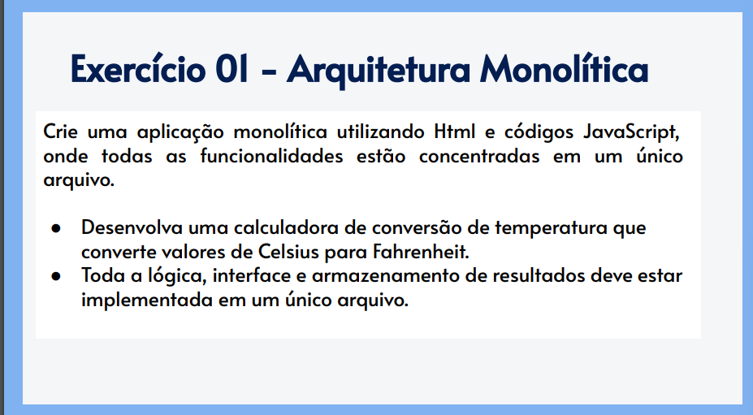
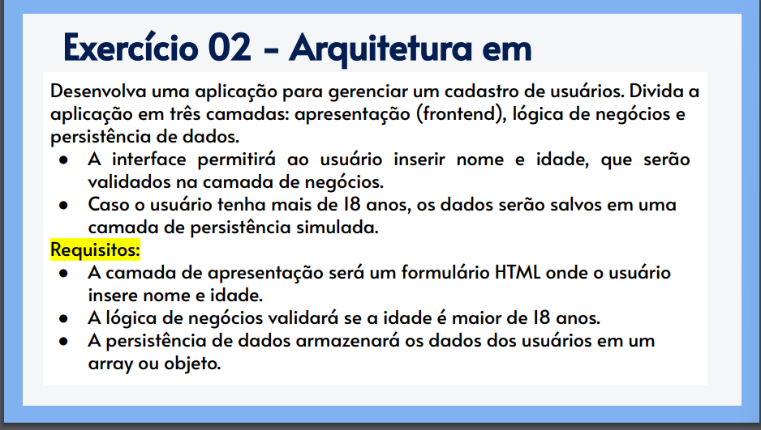
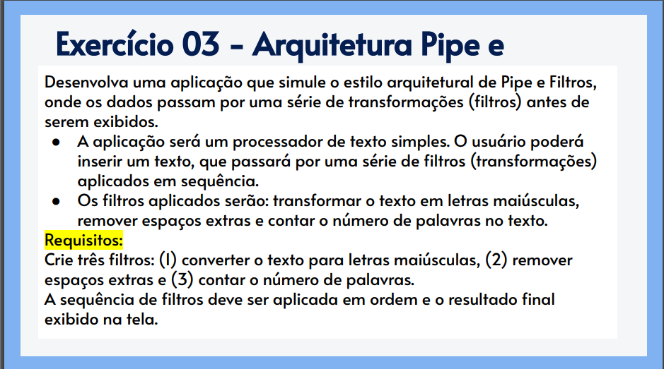

No README.MD responder as seguintes questões:

1. Quais são as principais desvantagens de concentrar toda a lógica, interface e dados em um único arquivo?

Desvantagens: Dificuldade de manutenção, baixa escalabilidade, pouca reutilização de código, e conflitos em colaboração.

2. Como a separação em camadas facilita a manutenção e a escalabilidade da aplicação?

Facilidade em camadas: Simplifica manutenção, melhora escalabilidade, facilita reutilização e aumenta flexibilidade.

3. Quais são os principais benefícios da arquitetura Pipe e Filtros para sistemas que precisam de flexibilidade nas transformações de dados?

Benefícios Pipe e Filtros: Modularidade, flexibilidade, reutilização de componentes, e fácil integração.

